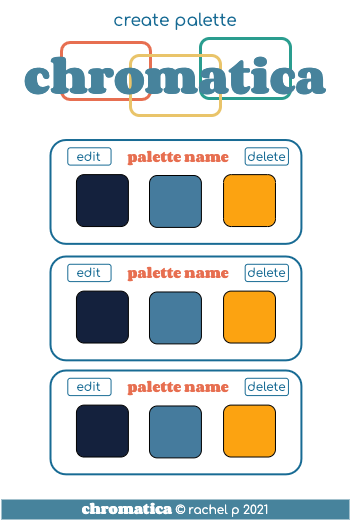
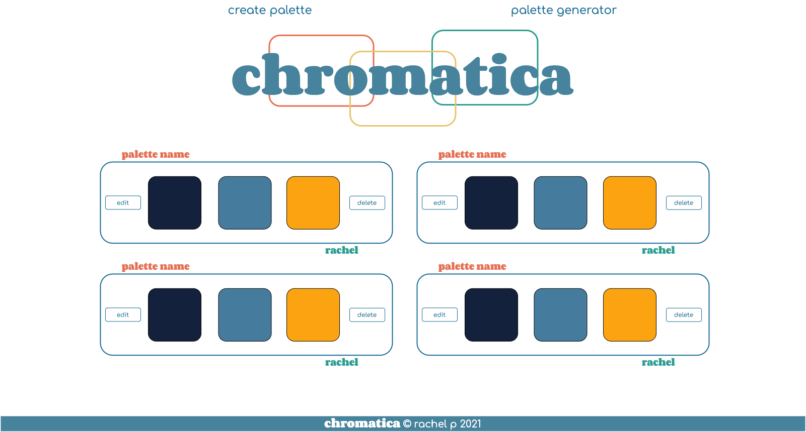
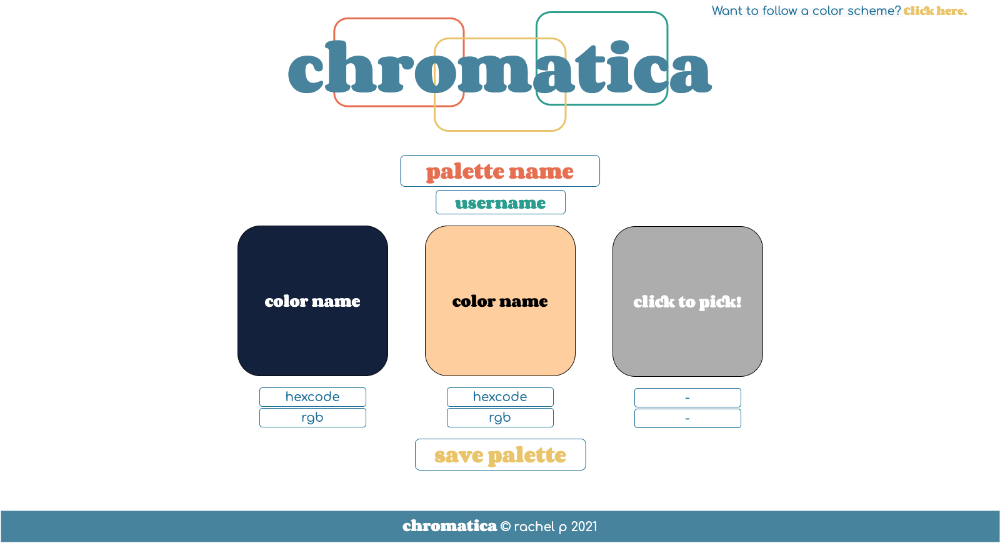
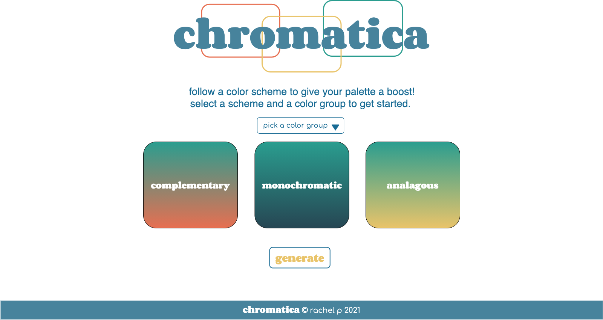

# Project Overview

## Project Name

Chromatica

## Project Description

An app that helps you pick limited color palettes.

## Wireframes

Mobile Home


Mobile Formpage


Desktop Home


Desktop Create Formpage


Desktop Generate Formpage (Post MVP)


## Component Hierarchy


## API and Data Sample

```
    "records": [
        {
            "id": "recCbfksc1Im7hU5w",
            "fields": {
                "hex2": "7A9B76",
                "hex3": "160C28",
                "color3": "Dark Purple",
                "color1": "Antique White",
                "username": "rachel",
                "hex1": "FCEBDA",
                "color2": "Russian Green",
                "palette": "chromatica color theme"
            },
            "createdTime": "2021-09-20T17:25:36.000Z"
        }
```

### MVP/PostMVP

The functionality will then be divided into two separate lists: MVP and PostMVP.  Carefully decide what is placed into your MVP, as the client will expect this functionality to be implemented upon project completion.  

#### MVP 

- Display created color palettes on home page
- Create, edit or delete a palette
- Use color picker/color API to allow user to select colors for their palette
- Phone + tablet sizes
    * 320px — 480px: Mobile devices.
    * 481px — 768px: iPads, Tablets.

#### PostMVP  

- Copy btn for each hexcode/rgb in a palette
- Choose a type of color scheme (monochromatic, complimentary, etc) and generate a new palette
- Small screen + large screen sizes
    * 769px — 1024px: Small screens, laptops.
    * 1025px — 1200px: Desktops, large screens.
- Nice transitions and styling

## Timeframes

| Component | Priority | Estimated Time | Time Invested | Actual Time |
| --- | :---: |  :---: | :---: | :---: |
| Create Components | H | 3hrs|  |  |
| Setup GET request in App component | H | 1hr |  |  |
| Create Color Picker | H | 3hrs |  |  |
| Create Palette Component | H | 2hrs |  |  |
| Create Edit Component | H | 3hrs |  |  |
| Add Edit Form | H | 1hrs |  |  |
| Create New Component | H | 2hrs |  |  |
| Add New Form | H | 1hrs |  |  |
| Add Header/Nav/Footer | H | 1hrs |  |  |
| Media Query Mobile | H | 3hrs |  |  |
| Media Query iPad | H | 2hrs |  |  |
| Styling App | M | 3hrs |  |  |
| Styling Components | M | 3hrs |  |  |
| grab random color palette from colorAPI | L | 2hrs |  |  |
| add generated palette to new form | L | 2hrs |  |  |
| Copy/Paste buttons | L | 2hrs |  |  |
| Test functionality | M | 3hrs |  |  |
| Transitions | L | 3hrs |  |  |
| Keep README updated | L | 1hrs |  |  |
| Code Cleanup | H | 1hr|  |  |
| Total | H | 42hrs|  | 39hrs |

## SWOT Analysis

### Strengths: I feel very confident in using React and I'm investing more time into the planning and organization than my last project.

### Weaknesses: Combining useage of color API + airtable

### Opportunities: Build smallest to biggest

### Threats: Styling. I need to push my styling priorities to post-MVP in order to really nail down the functionality before MVP is due.

## Code Wins!

copy/paste functionality
```
  async function copyText(e) {
    if (!navigator.clipboard) {
      return
    }
    const text = e.target.innerText
    try {
      await navigator.clipboard.writeText(text);
      e.target.className = "color-code copied"
      e.target.textContent = "copied!"
      setTimeout(() => {
        e.target.className = "color-code";
        e.target.textContent = text;
      }, 1000)
    } catch (err) {
      console.error('Failed to copy!', err)
    }
  };
```
hext to rgb conversion in form component
```
  function hexToRgb(hex) {
    const result = /^#?([a-f\d]{2})([a-f\d]{2})([a-f\d]{2})$/i.exec(hex);
    return result ? {
      r: parseInt(result[1], 16),
      g: parseInt(result[2], 16),
      b: parseInt(result[3], 16)
    } : null;
  }
```
useEffect to attach RGB to hexcode changes in colorinput component
```
    const [rgb, setRgb] = useState({});
    
    useEffect(() => {
    setRgb(props.hexToRgb(props.color1))
  },[props])
```
Axios call to remove '#' from the hexcode and make the GET request for color name. I was able to pass hexCode and setColorName as parameters so I could reuse the same function in each colorinput component
```
  const fetchName = async (hexCode, setcolorName) => {
    const colorCode = hexCode.replace('#', '')
    const response = await axios.get(`https://www.thecolorapi.com/id?hex=${colorCode}`);
    setcolorName(response.data.name.value);
  }
```
GET color name when unfocusing the color picker input in colorinput component
```
    onBlur={() => {
      props.fetchName(props.color1, props.setName1)
    }}
```